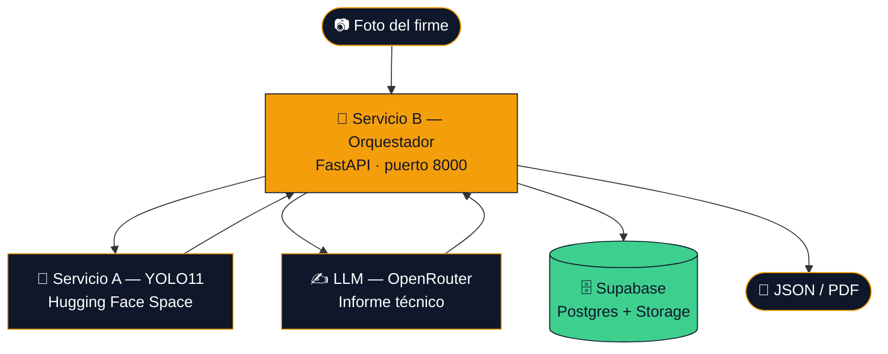
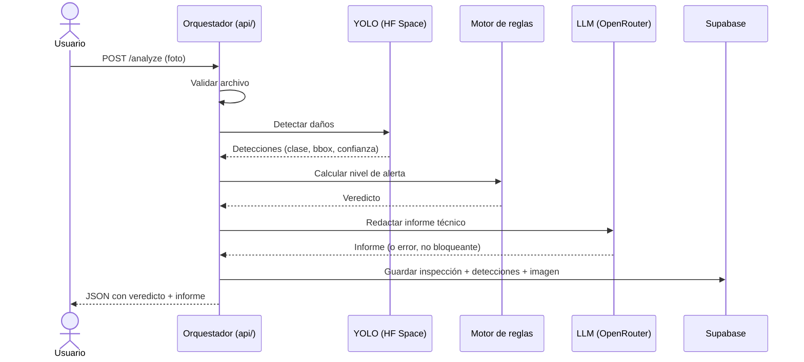
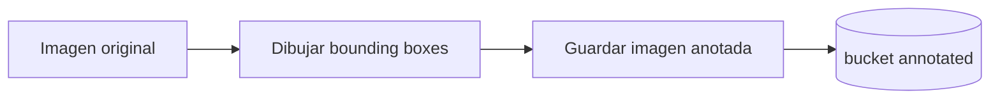
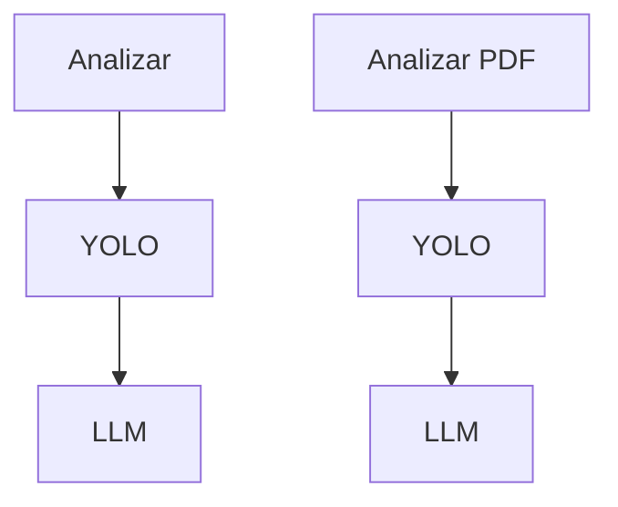
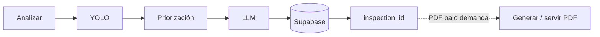

<div align="center">

# 🛣️ RoadGuardian AI Core

**Diagnóstico automático del estado del firme de carreteras mediante visión artificial e IA generativa**


Proyecto desarrollado como parte del **Bootcamp de Inteligencia Artificial de Factoría F5**

</div>

<br/>

RoadGuardian analiza fotografías del firme de una carretera y devuelve un diagnóstico completo: qué daños hay (baches, grietas...), qué nivel de alerta tienen, un informe técnico redactado por IA y, opcionalmente, un PDF listo para entregar. Cada inspección queda además guardada en base de datos para poder consultarla más adelante.

<br/>

## 🏗️ 1. Arquitectura

El proyecto son **dos servicios independientes** que se hablan por red, más una base de datos:



- **Servicio B — `api/`**: es el orquestador. No hace ni detección ni redacción por sí mismo: coordina las llamadas a los demás servicios y aplica las reglas de negocio. Es el único que consume el frontend.
- **Servicio A — el microservicio de YOLO**: vive fuera de este backend, desplegado como un Space de Hugging Face. Carga el modelo `yolo11m_roadguardian.pt` (entrenado a medida) y detecta los daños en la imagen.
  - Hay **dos formas de desplegarlo**, y ambas están en este repo:
    - `gradio/app.py` — Space de tipo **Gradio**. Es el que está desplegado **actualmente**, porque los Spaces de tipo Docker (la otra opción) dejaron de ser gratuitos.
    - `hf_space/` (con su `Dockerfile` y `main.py`) — Space de tipo **Docker** con una API FastAPI (`POST /predict`). Se conserva para el futuro, por si se vuelve a desplegar así.
  - El orquestador le habla a través de `api/services/yolo_client.py`, usando `gradio_client` contra el Space configurado en `YOLO_SPACE`.
- **LLM (OpenRouter)**: redacta el informe técnico en prosa a partir de las detecciones. Es un paso opcional: si falla, el resto del análisis se entrega igualmente.
- **Supabase**: base de datos (Postgres) + almacenamiento de archivos, donde se guarda cada inspección.

### 🕳️ ¿Qué detecta el modelo?

El modelo YOLO11m fue entrenado a medida para reconocer **4 clases de daño** en el firme. El motor de reglas (`prioritization/priority_engine.py`) no trata todas igual: usa umbrales distintos de superficie ocupada según lo peligrosa que sea cada una:

| Clase (YOLO) | Qué es | Cómo se evalúa su gravedad |
|---|---|---|
| 🕳️ **Pothole** (bache) | Hueco en el firme. El daño más peligroso: puede reventar un neumático o desestabilizar un vehículo. | `CRITICO` si ocupa más del 5 % de la imagen; si no, `ALTA`. Umbral bajo a propósito por su peligrosidad. |
| 🐊 **Alligator Crack** (grieta tipo cocodrilo) | Red de grietas entrelazadas por fatiga del firme, parecida a la piel de un cocodrilo. | `CRITICO` si >85 %, `ALTA` si >20 %, si no `MEDIA`. Umbrales más altos que el resto porque el bbox sobreestima el área real por la perspectiva de las fotos en carretera. |
| ↔️ **Transverse Crack** (grieta transversal) | Grieta perpendicular al sentido de la vía. | `ALTA` si >2 %, si no `MEDIA`. |
| ↕️ **Longitudinal Crack** (grieta longitudinal) | Grieta paralela al sentido de la vía; suele ser el primer síntoma de deterioro del firme. | `MEDIA` si >2 %, si no `BAJA`. |

Por debajo del 25 % de confianza, cualquier detección se considera dudosa y se marca directamente como `BAJA`, sea cual sea su clase — es un filtro de seguridad para no disparar alertas por falsos positivos poco fiables.

<br/>

## 🔄 2. Flujo completo de un análisis (`POST /analyze`)



1. **Validación** — se comprueba que el archivo no esté vacío, que no supere el tamaño máximo y que sea una imagen (`api/routes/analyze.py`, función `_validar`).
2. **YOLO** — se manda la imagen al Space de Hugging Face y se reciben las detecciones (clase, confianza, bounding box). Si YOLO no responde, aquí sí se corta todo con un error 503: sin detecciones no hay nada que analizar.
3. **Motor de reglas (`prioritization/`)** — un algoritmo determinista (no usa IA) calcula, según el tipo de daño y qué porcentaje de la imagen ocupa, el `nivel_alerta` final: `ESTABLE`, `BAJA`, `MEDIA`, `ALTA` o `CRITICO`. Si esto falla es un bug real, así que no se enmascara el error.
4. **LLM (`llm/report.py`)** — con la foto, las detecciones y el nivel de alerta ya decidido, se le pide a un modelo de OpenRouter que redacte el informe técnico en markdown. El prompt (`llm/prompts/system.md`) le prohíbe explícitamente recalcular el nivel de alerta: solo puede explicarlo y señalar posibles falsos positivos.
   - Si este paso falla (falta la API key, se acaba la cuota, timeout...), **no se rompe la petición**: se devuelve `informe: null` junto con `informe_error` explicando el motivo, y el veredicto del motor de reglas sigue siendo válido.
5. **Persistencia en Supabase** — se guarda todo (ver sección siguiente).
6. **Respuesta** — se devuelve el JSON completo al frontend.

<br/>

## 📡 3. Endpoints disponibles

**Orquestador** (`api/`, puerto 8000)

| Método | Ruta | Qué hace |
|:---:|---|---|
|  | `/` | Salud del servicio: si está online y si la configuración (API keys) está completa. |
|  | `/analyze` | Sube una foto → devuelve el análisis completo en JSON (detecciones, veredicto, informe). Guarda la inspección en Supabase. |
|  | `/analyze/pdf` | Igual que `/analyze`, pero devuelve el informe maquetado en PDF en vez de JSON. |

**Microservicio YOLO** (Hugging Face Space)

| Método | Ruta | Qué hace |
|:---:|---|---|
|  | `/` | Salud del servicio y confirmación de qué modelo tiene cargado. |
|  | `/predict` | Recibe una imagen y devuelve las detecciones en JSON (clase, confianza, bbox). |

<br/>

## 🗄️ 4. Persistencia en Supabase

Esta es la parte nueva desarrollada en los últimos días. Mientras el usuario recibe el resultado, el backend guarda automáticamente toda la información en Supabase.

Actualmente se almacena:

| Dónde | Qué se guarda |
|---|---|
| **Storage** | ✅ Imagen original. |
| **Tabla `inspections`** | Fecha · nombre del archivo · nivel de alerta · acción recomendada · número de detecciones · estado · referencia a la imagen. |
| **Tabla `detections`** | Cada detección por separado: tipo de daño · confianza · bounding box · relación con la inspección mediante `inspection_id`. |

Gracias a esto, cada inspección queda registrada y puede recuperarse posteriormente.

> **Nota:** `api/services/supabase_service.py` ya tiene definidas (pero sin implementar, con `pass`) las funciones `get_inspections`, `get_inspection` y `delete_inspection`. Están así a propósito, preparadas para integrarlas más adelante cuando exista el historial en el frontend (ver [Qué queda para el futuro](#-qué-queda-para-el-futuro)).

<br/>

## 📄 5. Generación del PDF

Cuando el usuario pulsa **Analizar con PDF**, el sistema vuelve a realizar el análisis completo y genera un informe en formato PDF listo para descargar (`reports/pdf.py`).

Que `/analyze` y `/analyze/pdf` sean dos llamadas independientes es intencional: en el frontend el usuario elige si quiere el resultado con PDF o sin él, y por eso son dos rutas separadas en vez de una sola.

Actualmente este PDF **no se guarda todavía** en Supabase; simplemente se genera y se devuelve al usuario en la misma petición.

<br/>

## 🔑 6. Variables de entorno

Se configuran en un archivo `.env` en la raíz (hay un `.env.example` de referencia, sin valores reales).

| Variable | Obligatoria | Para qué sirve |
|---|:---:|---|
| `OPENROUTER_API_KEY` | ⚠️ Degrada sin ella | Autentica las llamadas al LLM que redacta el informe. |
| `MODEL_NAME` | ⚠️ Degrada sin ella | Qué modelo de OpenRouter usar (ej. `google/gemma-4-26b-a4b-it:free`). |
| `SUPABASE_URL` | ✅ Sí | URL del proyecto de Supabase. |
| `SUPABASE_SERVICE_ROLE_KEY` | ✅ Sí | Clave de servicio de Supabase (acceso total: solo debe usarla el backend, nunca el frontend). |
| `YOLO_SPACE` | ➖ No | Space de Hugging Face al que se le mandan las fotos a analizar (ej. `usuario/roadguardian-api`). |
| `HF_USER` | 🔧 Solo despliegue | Usuario de Hugging Face; construye el nombre del repo del modelo y del Space (`scripts/`). |
| `HF_TOKEN` | 🔧 Solo despliegue | Token de Hugging Face para subir el modelo o el Space, y descargar modelos privados. |
| `CORS_ORIGINS` | ➖ No | Orígenes autorizados a llamar a la API desde el navegador (coma-separados). |
| `CORS_ORIGIN_REGEX` | ➖ No | Patrón para autorizar de golpe todos los dominios de preview de Vercel. |
| `MAX_UPLOAD_MB` | ➖ No | Tamaño máximo de imagen admitido, en MB (por defecto 15). |
| `YOLO_TIMEOUT_SECONDS` | ➖ No | Cuánto se espera a que responda YOLO antes de dar timeout (por defecto 120s: en Render el arranque en frío puede tardar). |

- ⚠️ **Degrada sin ella**: si falta, el servicio arranca igual y el veredicto se entrega sin informe de texto (`informe_error` explica el motivo).
- ✅ **Sí**: sin ella el servicio **no arranca** — `api/services/supabase_client.py` lanza un error al importarse.
- ➖ **No**: tiene un valor por defecto razonable en `api/config.py`.

<br/>

## 🚀 7. Cómo arrancar el orquestador en local

```bash
# Instalar dependencias
uv sync
# o, alternativamente:
pip install -r requirements.txt

# Arrancar el servicio (puerto 8000)
uvicorn api.main:app --reload --port 8000
```

El servicio de YOLO no hace falta arrancarlo en local: el orquestador habla directamente con el Space de Hugging Face configurado en `YOLO_SPACE`.

<br/>

## 📁 8. Estructura de carpetas

```
api/                  Servicio B: el orquestador (FastAPI, puerto 8000)
  main.py             Arranque de la app y comprobación de configuración
  config.py           Lectura centralizada de variables de entorno
  routes/analyze.py   Endpoints /analyze y /analyze/pdf
  schemas/            Modelos Pydantic de la respuesta
  services/
    yolo_client.py         Cliente contra el Space de YOLO (gradio_client)
    supabase_client.py     Cliente de Supabase
    supabase_service.py    Guardar/leer inspecciones y detecciones
    storage_service.py     Subir archivos a Supabase Storage

llm/                  Generación del informe técnico
  report.py           Llamada al LLM vía OpenRouter
  prompts/            Prompts en markdown (system.md, informe.md)

prioritization/       Motor de reglas determinista (nivel de alerta)

reports/              Generación del PDF maquetado
  pdf.py
  draw.py             Dibuja las detecciones sobre la imagen

hf_space/             Servicio A (variante Docker, reservada para el futuro)
  main.py, Dockerfile

gradio/                Servicio A (variante Gradio, la desplegada actualmente)
  app.py

scripts/              Utilidades de despliegue a Hugging Face
  deploy_space.py     Sube hf_space/ como Space tipo Docker
  upload_model.py     Sube los pesos del modelo (models/best.pt) al Hub

tests/                Tests del motor de reglas y de los prompts
```

<br/>

## 🔮 Qué queda para el futuro

El proyecto ya funciona de principio a fin, pero hay varias mejoras previstas.

### 1. Guardar la imagen anotada

Ya se dispone de los **bounding boxes**, pero todavía no se dibujan esos rectángulos sobre una copia de la imagen para guardarla.



### 2. Guardar el PDF

Actualmente el PDF solo se descarga. La idea es almacenarlo también en el bucket `reports` para que pueda descargarse más adelante sin volver a generarlo.

### 3. Evitar ejecutar dos veces el análisis

Ahora mismo, si el usuario pulsa los dos botones, el sistema ejecuta **dos veces YOLO y dos veces el LLM**:



La idea es mejorar la arquitectura para analizar **una sola vez** y servir el PDF bajo demanda a partir de lo ya guardado:



### 4. Historial de inspecciones

Como ya se guarda toda la información en Supabase, el siguiente paso natural es crear un historial en el frontend donde el usuario pueda:

- Consultar inspecciones anteriores.
- Ver la imagen original y la imagen anotada.
- Descargar el PDF.
- Revisar las detecciones.
- Filtrar por fecha o nivel de alerta.

<br/>

---

## 👥 Equipo

<div align="center">

| | Nombre | Rol |
|:---:|---|---|
| 🧭 | **Gema Yébenes** |  · Desarrollo |
| 🎯 | **Camila Arenas** |  · Desarrollo |
| 👤 | **Joaquín Lázaro** |  |
| 👤 | **Maryori Cruz** |  |

</div>

<div align="center">

🛣️ Proyecto desarrollado en el **Bootcamp de Inteligencia Artificial de Factoría F5**

</div>
